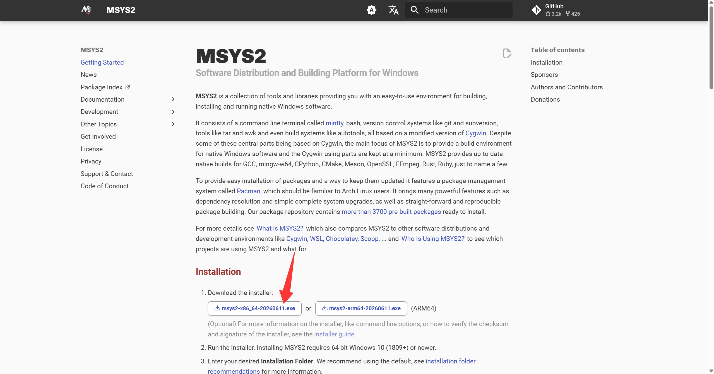
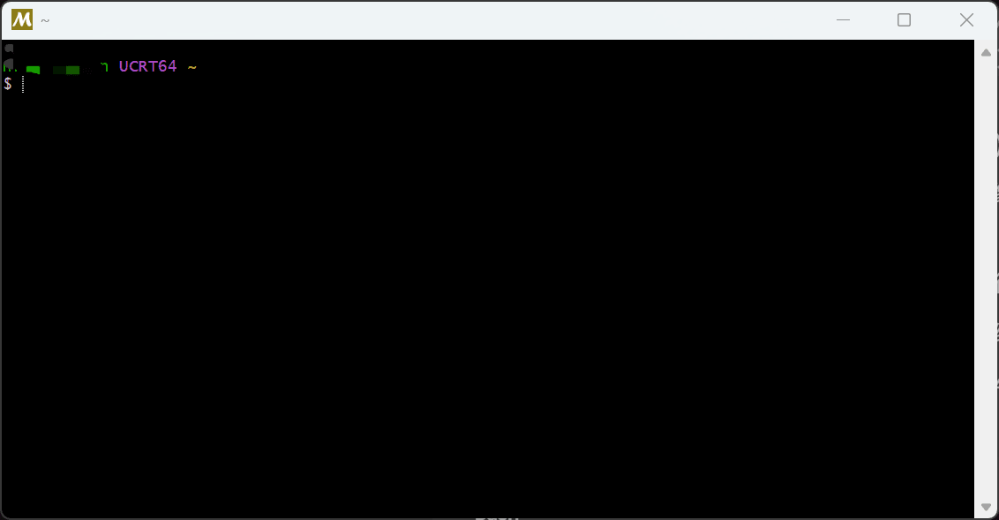
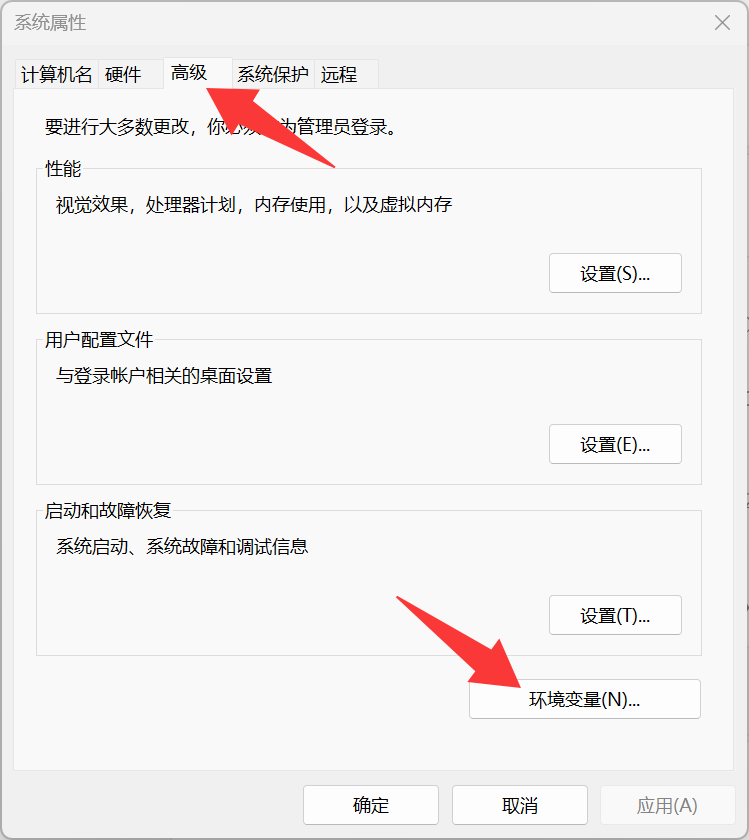
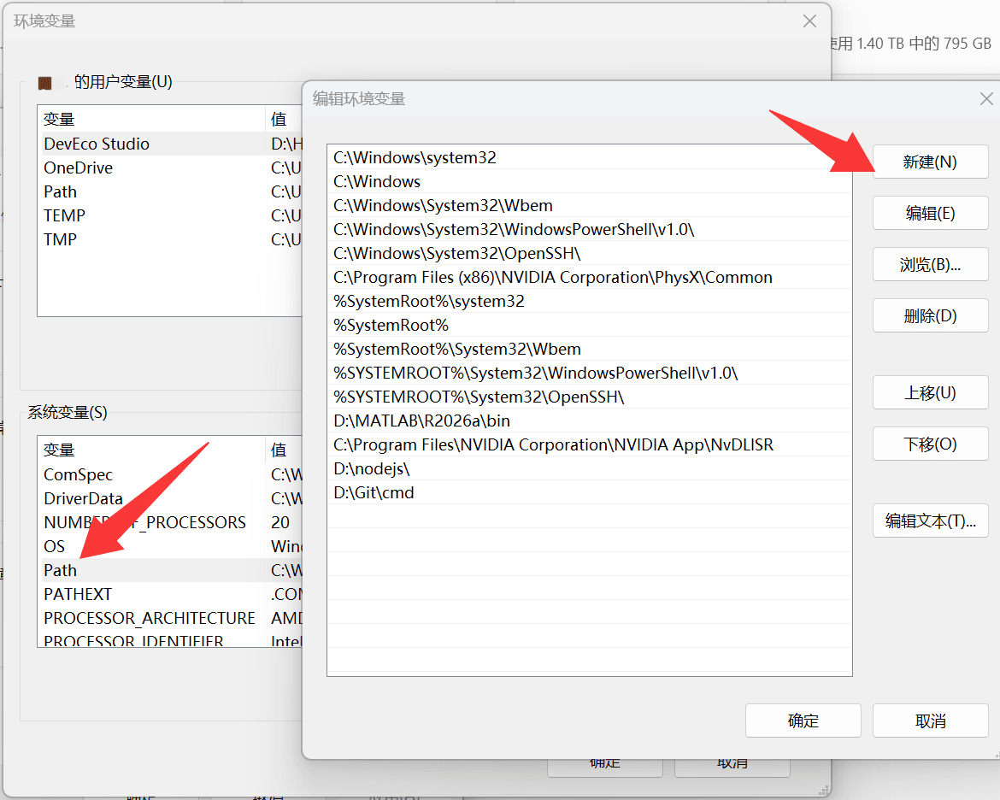
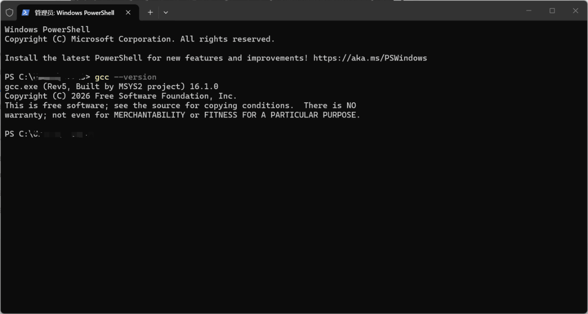
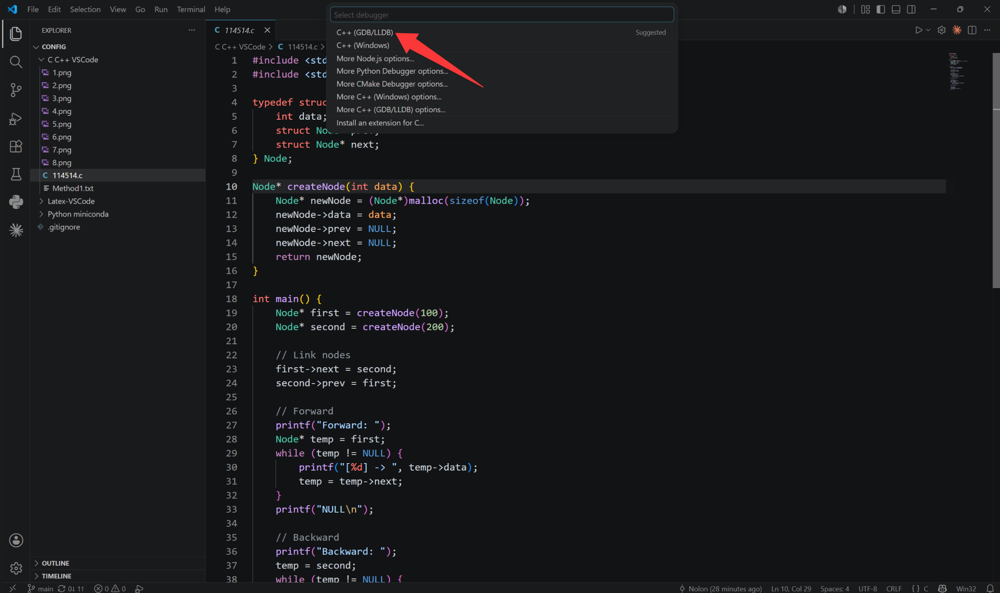
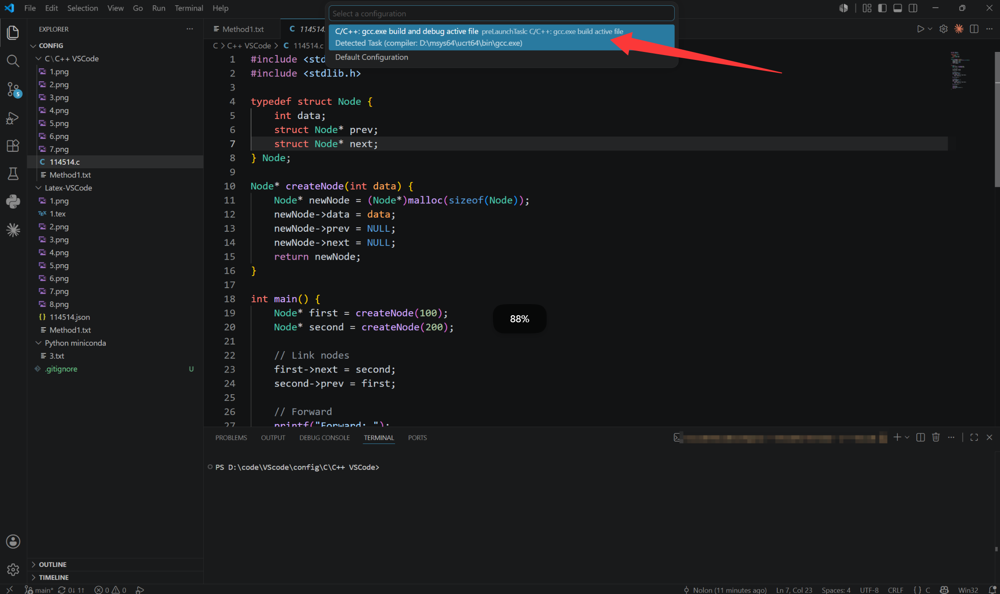

## 下载编译器

打开 [https://www.msys2.org/](https://www.msys2.org/)

下载 `msys2-x86_64-20260611.exe`，安装



完成后会出现msys2窗口，手动输入

```
pacman -S --needed base-devel mingw-w64-ucrt-x86_64-toolchain
```

并执行，安装完成后，先不关闭窗口



## 添加环境变量

复制MinGW文件下 `\msys64\ucrt64\bin` 的路径

设置->关于->高级系统设置->高级->环境变量->系统变量->Path->新建，然后将bin/的路径粘贴






在Windows终端输入 `gcc --version`，显示版本号则成功，可将msys2窗口关闭



## 安装扩展

打开vscode扩展商店，下载 C/C++ Extension Pack(内含4个扩展) 和 C/C++ Compile Run 和 Better C++ Syntax(让代码高亮更好看，可不装) 三个扩展

打开C/C++ Compile Run扩展，点设置->扩展设置，找到"C-cpp-compile-run:Run-in-external-terminal"，勾选则在额外的terminal窗口运行，不勾选则在vscode底部terminal运行

运行本文件夹的 `114514.c`(路径不能有中文)，选择 C++(GDB/LLDB)





输出：

```
Forward: [100] -> [200] -> NULL
Backward: [200] -> [100] -> NULL
Hello, World!
```

则成功
