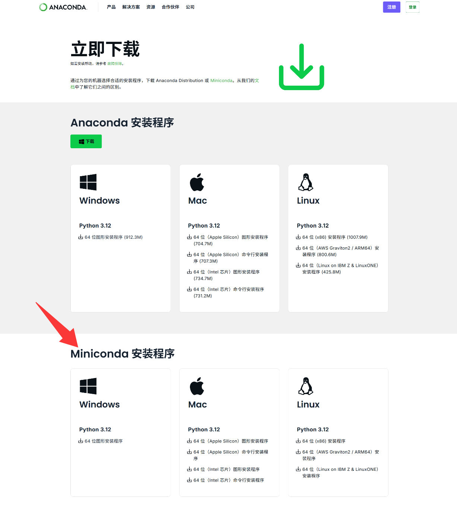
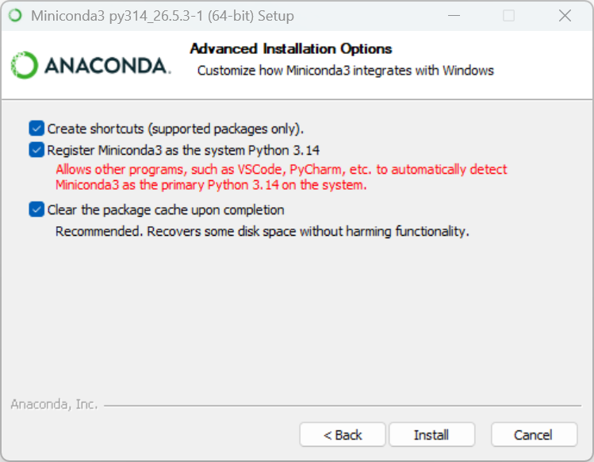
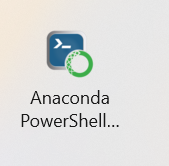
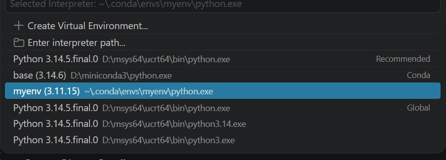

## 下载

下载python环境管理工具Miniconda：[https://docs.anaconda.net.cn/miniconda/](https://docs.anaconda.net.cn/miniconda/)，注意不要错下成Anaconda



勾选三个



安装完成后将Anaconda Powershell Prompt固定到开始或桌面



若想通过Windows Powershell使用conda，将 `\miniconda3` 和 `\miniconda3\Scripts` 和 `\miniconda3\Library\bin` 添加到环境变量(为了保持环境变量简洁，不建议)

## 授权

给miniconda授权以防止以后创建环境时在C盘而非安装miniconda的位置创建

右击 `miniconda3\` 属性->安全->编辑->Users->完全控制勾选允许

## 环境管理指令

今后使用python时在conda里活动，不建议再使用Windows系统环境，可以把系统的python删除，以下以myenv作为示例虚拟环境

查看有哪些虚拟环境  `conda env list` 或 `conda info --envs`

激活虚拟环境        `conda activate myenv`

退出虚拟环境        `conda deactivate`

列出某环境有哪些库  `conda list`

安装库

```
conda activate myenv
conda install matplotlib
```

或

```
conda install --name myenv matplotlib
```

或

```
pip install（能不用则不用，有些包conda仓库没有只能通过pip下载）
```

创建环境            `conda create -n myenv python=3.11` 或 `conda create --name myenv`

python版本不是越高越好，目前(2026)3.10和3.11最稳定

删除环境            `conda env remove -n myenv`

查看py版本          `python --version`

查看conda版本       `conda --version`

更新conda版本

```
conda activate（回到默认环境）
conda update conda
```

## 使用

在VSCode下载python扩展，选环境 `ctrl+shift+p` 然后 `python:select interpreter`

myenv是手动创建的环境，base是安装miniconda时自动创建的初始环境



运行本文件夹的 `114514.py` 可检验
